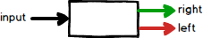
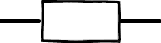
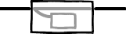
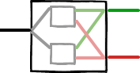

# Railway

This library is based on a post from (Scott Wlaschin)[https://fsharpforfunandprofit.com/posts/recipe-part2/] in order to bring Railway Oriented Programming to PHP.

## Motivation

Typically every use case receives a request and produces a response. The use case passes for several steps until gets the final response to be returned. Handle every error scenario could be tedious and difficult to read. 

## Either

In order to have a type that works with any workflow, we borrow the type `Either` from functional programming:

 

This object acts as a **switch**, where _left_ means failure and the _right_ means success.  

## Railway Naming Convention

> Railways have switches ("points" in the UK) for directing trains onto a different track. We can think of these “Success/Failure” functions as railway switches.

- One track function: it has 1 input and 1 output.

 

- Two track function: it has 2 input (`Either`) and 2 output (`Either`).

 
- Switch: it has 1 input and 2 output (`Either`).

 
## Functions

Please find below the list of functions which connects switch together:

### Map

**1-1 : 2-2**

Converts one track function into two track function.

 

### Lift

Converts one track function into switch.

**1-1 : 1-2**

 

### Bind

Converts switch into two track function.

**1-2 : 2-2**

 

### Unite

Join two switches into another switch.

**1-2 and 1-2 : 1-2**

 

### Tee

Dead-function to one track function.

 

### TryCatch

Handling exceptions. Convert one track function into switch.

**1-1 : 1-2**

 

### Plus

Combines switch functions in parallel.

**1-2 + 1-2 : 1-2**

 

### DoubleMap

Handles both tracks, converting one track into two track function.

**1-1 : 2-2**

 
